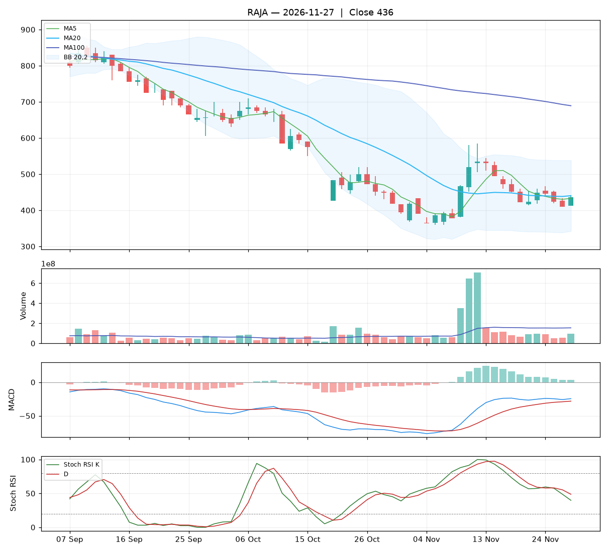

# Analisa harian RAJA — 2026-11-27

## Ringkasan

| Open | High | Low | Close | Perubahan | Volume |
|---|---|---|---|---|---|
| 412 | 440 | 412 | **436** | +26 (+6.34%) | 95.745.200 |

### ⚪ Keputusan teknikal: **TUNGGU** — nilai total **4.5/10**

Sinyal campur aduk. Belum ada alasan teknikal yang jelas untuk masuk.

| Aspek | Nilai | |
|---|---|---|
| Tren | **2.0**/10 | `██░░░░░░░░` |
| Volume | **5.6**/10 | `██████░░░░` |
| Stochastic | **3.5**/10 | `████░░░░░░` |
| Momentum | **6.0**/10 | `██████░░░░` |
| Candle | **6.3**/10 | `██████░░░░` |

**Level harga (otomatis):**

- Support 20 hari: 360 · Resistance 20 hari: 585
- Batas rugi (stop loss): 360 (di bawah support atau −5%)
- Target 1: 440 · Target 2: 585
- Rasio untung : rugi ke target 1 = 0.06 : 1 (kurang menarik, idealnya ≥ 1,5)

## 1. Candlestick

Candle hijau (ditutup naik). Badan 86% dari rentang hari ini, sumbu atas 14%, sumbu bawah 0%.

- Tidak ada pola candle khusus yang terdeteksi.

## 2. Volume

- Volume hari ini 95.745.200 lembar, rata-rata 20 hari 153.896.315 (**0.62x** rata-rata).
- Volume sepi: pergerakan hari ini kurang meyakinkan.
- 5 hari terakhir: volume candle hijau 50%, candle merah 50%.

## 3. Stochastic & Stoch RSI

- Stochastic (14,3,3): %K 23.7, %D 28.8, zona **tengah**.
- Stoch RSI (14,14,3,3): K 39.8, D 48.7, zona **tengah**.
- K di bawah D: momentum masih turun.

## 4. Tren (Moving Average)

Tren jangka pendek: **turun** (MA20 berubah -1 dalam 5 hari).
- Harga di atas MA5 (433).
- Harga di bawah MA20 (440).
- Harga di bawah MA100 (689).

## 5. Bollinger Bands

- Bollinger (20,2): atas 538, tengah 440, bawah 342. Posisi harga 48% dari pita bawah ke atas, lebar pita 44.5%.

## 6. MACD & RSI

- MACD (12,26,9): garis -24.46, sinyal -28.18, histogram 3.72.
- Histogram membaik dibanding kemarin: tekanan turun berkurang / tekanan naik bertambah.
- MACD masih di bawah nol: tren menengah masih lemah.
- RSI (14): 44.4.

## 7. Support & Resistance

- Support 20 hari (low terendah): 360.
- Resistance 20 hari (high tertinggi): 585.
- Resistance terdekat lain: MA20 440, MA100 689.

## 8. Fundamental (laporan keuangan)

**Nilai fundamental: 8.2/10 — Kuat** (terpisah dari keputusan teknikal; dipakai untuk menilai kualitas perusahaan jangka panjang).

| PER | PBV | ROE | DER | Margin laba | Pendapatan YoY | Laba YoY | Kapitalisasi |
|---|---|---|---|---|---|---|---|
| 13.6 | 2.16 | 21.2% | 1.16x | 14.8% | 6.2% | 30.1% | 9.18 T |

Laporan keuangan emiten ini disajikan dalam **USD**. PBV dihitung ulang dengan kurs USD/IDR 18.375.

Laporan laba rugi per kuartal (juta USD):

| Periode | Pendapatan | Laba bersih |
|---|---|---|
| 2026-09-30 | 72.7 | 8.3 |
| 2026-06-30 | 75.9 | 14.1 |
| 2026-03-31 | 55.3 | 8.6 |
| 2025-12-31 | 70.6 | 9.5 |
| 2025-09-30 | 68.4 | 6.4 |

| Kondisi | Poin |
|---|---|
| PER 13.6x: wajar | +0.25 |
| ROE 21%: sangat efisien | +1.25 |
| Margin laba bersih 15%: sehat | +0.50 |
| Pendapatan tumbuh +6% YoY | +0.25 |
| Laba bersih tumbuh +30% YoY | +0.90 |

_Sumber: Yahoo Finance. Untuk keputusan penting, cocokkan dengan laporan resmi di idx.co.id._

## 9. Cara nilai teknikal dihitung

Setiap aspek mulai dari **5** (netral), lalu ditambah atau dikurangi poin di bawah ini, dan dibatasi 0–10. Nilai total = rata-rata berbobot.

**Tren: 2.0/10** (bobot 25%)

| Kondisi | Poin |
|---|---|
| Harga di atas MA5 | +1.00 |
| Harga di bawah MA20 | -1.50 |
| Harga di bawah MA100 | -1.50 |
| MA20 menurun dalam 5 hari | -1.00 |

**Volume: 5.6/10** (bobot 20%)

| Kondisi | Poin |
|---|---|
| Harga naik dengan volume 0.62x rata-rata 20 hari | +0.62 |
| Volume hijau 5 hari 50% (akumulasi vs distribusi) | +0.00 |

**Stochastic: 3.5/10** (bobot 20%)

| Kondisi | Poin |
|---|---|
| Stochastic: K di bawah D | -0.75 |
| Stoch RSI: K di bawah D | -0.75 |

**Momentum: 6.0/10** (bobot 20%)

| Kondisi | Poin |
|---|---|
| MACD di atas garis sinyal | +1.50 |
| MACD di bawah nol | -1.00 |
| Histogram MACD membaik | +1.00 |
| RSI 44 di zona lemah (30–50) | -0.50 |

**Candle: 6.3/10** (bobot 15%)

| Kondisi | Poin |
|---|---|
| Badan candle hijau 86% dari rentang | +1.29 |

_Laporan ini dibuat otomatis dari aturan teknikal sederhana. Bukan rekomendasi beli atau jual; selalu kombinasikan dengan analisa sendiri dan manajemen risiko._
